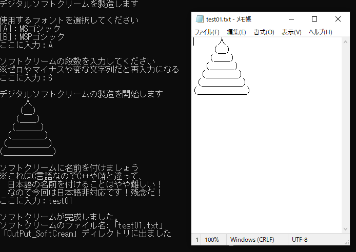

# このリポジトリは何？
「個別のリポジトリを作る程のものではないけど公開はしとくか」という感じのものを放り込む砂場(ゴミ置き場)。

  
# これに入ってるツール一覧

## 指定した範囲の数で連番フォルダ作るだけのツール
指定した数の範囲の連番フォルダ作るだけのツール。htmlとJSとcssだけで作成、ブラウザで開くだけで使用可能。連番の形式を数種類の中から選択することが可能。ブラウザの動作が重くなってしまうので連番は1000までにした。MITライセンス。  
  
  

## SoftCreamAA_Maker
ソフトクリームのアスキーアートを生成するC言語プログラム。ソフトクリームの段数、使用するフォント(MSゴシック or MSPゴシック)を指定することが可能。コンパイルと実行を行うバッチファイルが付属。MITライセンス。  
  